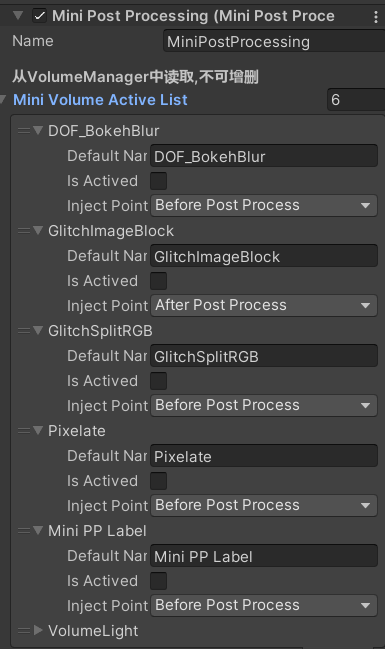

# Mini-PostProcessing
**A mini post processing system based on urp, you can customize your own post process simply.**

URP version: 12.1.7

## Features

* Bloom
* Gaussian Blur
* SSAO
* Pixelate
* Glitch
* Volume Light
* DOF
* Brightness Saturation And Contrast

## Usage

先来看类图设计(配合源码使用)

**使用方法**

复制`TemplateMiniPostProcess.cs`文件和`Template.shader` 文件，根据具体需求修改。

勾选所需的后处理(check)，最后在volume上添加override;上图决定是否启用，下图则是具体调参。

**简单流程图**

可根据需求定制，后续会持续更新后处理算法的简单实现。

## Credits

* [PamisuMyon/pamisu-kit-unity: Self-using tool kit for Unity game development. (github.com)](https://github.com/PamisuMyon/pamisu-kit-unity)
* [QianMo/X-PostProcessing-Library: Unity Post Processing Stack Library | Unity引擎的高品质后处理库 (github.com)](https://github.com/QianMo/X-PostProcessing-Library)
